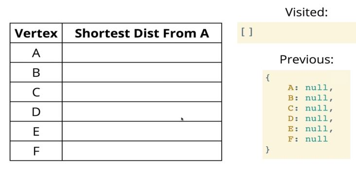

# Dijkstra's Algorithm

## Introduction
- Dijkstra’s Shortest Path Algorithm acts upon and searches across a graph. The algorithm is implemented by using a priority queue.
- Dijkstra’s algorithm is one of the most famous and widely used in the computer science community. This algorithm finds the shortest path between two points on a graph.
- Edsger Dijkstra was a Dutch programmer, physicist, and essayist. He helped advance the field of computer science from an “art” to an academic discipline.
- He created the shortest path algorithm because he wanted to demonstrate to the populous why computers were useful and important.
- His algorithm is still useful in the following applications:
    - GPS navigation: Finding the shortest path.
    - Network Routing: Finds open, shortest path for data.
    - Biology: Used to model the spread of viruses among humans.
    - Airline Tickets: Finding the least expensive route to your destination.
- To implement the shortest path algorithm on a graph, the edges of a graph must be assigned some value that can be compared. For GPS navigation, this would be distance.
## Weighted Graphs
- A weighted graph differs from an unweighted graph in that the edges are assigned values. This can be done by changing the structure of the adjacency list in the Graph class. In the Unweighted Graph class, the adjacency list comprised of an array that stored a list of strings, which were the name of each vertex.
- To add weight to the graph, the adjacency list should be an array that stores a list of objects that define each node. Each node object will have node property that will store its name and weight property that defines the weight of the edge formed between it and its neighbor node.
## Algorithm
- Every time you visit a node, you pick the node with the smallest known distance to visit first.
- Once you’ve moved to the node you’re going to visit, you look at each of its neighbors.
- For each neighboring node, you calculate the distance by summing the total edges that lead to the node we’re checking from the starting node.
- If the new total distance is less than the previous total distance, you store the new total distance for that node.
- Example Graph:
    
    
- For example, if we start at vertex A in the graph above. You make a table with two columns. The left column has each vertex, and the right column has distances from the starting vertex (A in this case). You fill out the table by putting 0 for the row for A (the distance from A to A is zero) and infinity (an arbitrarily high number) for the rest.
- Following the first step in the algorithm, you pick A because it has the shortest distance to A in the table. You add A to the visited list, then look at its neighbors.
- Moving alphabetically, you update the distance from A to B to be 4, then set the value of B in previous to be A (the node that came before B on the current path).
- You do the same thing for C, updating its distance from A to be 2 and its previous to be A. This completes the process for vertex A.
- Next, we move to vertex C because it has the shortest distance to A (besides A).
- Now that you’re analyzing vertex C, you add it to the visited list and calculate the distance from A to C’s neighbors through C. For vertex D, this would be 4 and its previous would now be C.
- You continue this process for the rest of the vertices (except the last one), updating the table and previous object when you find a distance from A that is less than the current low.
## Priority Queue
- In a basic priority queue, each item is an object with a value and a priority, and the queue is implemented with array. Each time an item is enqueued, the array is sorted by priority.
- This approach, while sufficient, is inefficient because it requires sorting the array each time an item is added, resulting in a time complexity of O(n*log(n)).
- A better way of implementing the queue, as seen previously, is a binary heap.
## Pseudocode
- The function should accept a starting and ending vertex (to define the path to be taken).
- Create an object called distances. Set the keys of the object to be the vertices of the graph and the associated values to infinity, except for the starting vertex, which should be given a value of zero.
- After setting a value in the distances object, add each vertex, except the starting vertex, with a priority of infinity to the priority queue. Add the starting vertex to the priority queue with a priority of zero because that's where we start.
- Create another object called previous and set the keys of the object to be the vertices of the graph and the associated values to be null.
- Start looping while there are vertices in the priority queue:
    - Dequeue a vertex from the priority queue. If that vertex is the same as the ending vertex, break out of the loop.
    - Otherwise loop through each value in the adjacency list for that vertex.
    - Calculate the distance from the starting vertex to the current vertex in the loop.
    - If the distance is less than that which is stored in the distances object, update the object with the new lower distance. Also update the previous object to contain that vertex.
    - Finally, enqueue the vertex with the total distance from the start node.