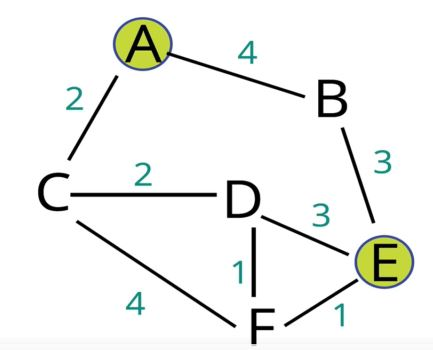

# Dijkstra's Algorithm

## Introduction
- Dijkstra’s Shortest Path Algorithm acts upon and searches across a graph. The algorithm is implemented by using a priority queue.
- Dijkstra’s algorithm is one of the most famous and widely used in the computer science community. This algorithm finds the shortest path between two points on a graph.
- Edsger Dijkstra was a Dutch programmer, physicist, and essayist. He helped advance the field of computer science from an “art” to an academic discipline.
- He created the shortest path algorithm because he wanted to demonstrate to the populous why computers were useful and important.
- His algorithm is still useful in the following applications:
    - GPS navigation: Finding the shortest path.
    - Network Routing: Finds open, shortest path for data.
    - Biology: Used to model the spread of viruses among humans.
    - Airline Tickets: Finding the least expensive route to your destination.
- To implement the shortest path algorithm on a graph, the edges of a graph must be assigned some value that can be compared. For GPS navigation, this would be distance.
## Weighted Graphs
- A weighted graph differs from an unweighted graph in that the edges are assigned values. This can be done by changing the structure of the adjacency list in the Graph class. In the Unweighted Graph class, the adjacency list comprised of an array that stored a list of strings, which were the name of each vertex.
- To add weight to the graph, the adjacency list should be an array that stores a list of objects that define each node. Each node object will have node property that will store its name and weight property that defines the weight of the edge formed between it and its neighbor node.
## Algorithm
- Every time you visit a node, you pick the node with the smallest known distance to visit first.
- Once you’ve moved to the node you’re going to visit, you look at each of its neighbors.
- For each neighboring node, you calculate the distance by summing the total edges that lead to the node we’re checking from the starting node.
- If the new total distance is less than the previous total distance, you store the new total distance for that node.
- Example Graph:
    
    