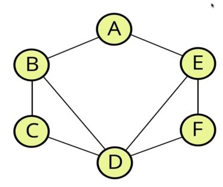

# Graph Traversal

## Introduction
- Just as tree traversal means visiting every node in a tree, graph traversal means visiting, updating, or checking each vertex (node) in a graph.
- Graph traversal has many real-world applications, including:
    - Peer to peer networking
    - Web crawlers
    - Finding the “closest” matches or recommendations for a user.
    - Shortest path problems:
        - GPS navigation
        - Solving mazes
        - AI (Shortest path to win a game)
- Unlike tree traversal, when traversing a graph, you may need to visit a node more than once.
## Depth-First Graph Traversal: Overview
- To review depth-first search generally involves visiting child nodes before visiting sibling nodes (you deepen the traversal before widening it). Each depth-first method only varies in the order in which the children are visited. Since there is no root node in a graph, it’s harder to determine what “depth” means for a graph.
- A simple definition of depth-first searching in graphs is to start at a node and visit it’s neighbor, then it’s neighbor’s neighbor and so on, moving away from the starting node before coming back to it to visit its neighbors.
- When deciding which direction to start traversing in, you can choose an alphabetical or numeric order, depending on the nature of the data stored in the graph.
  
- In the example graph, a depth-first search would mean visiting nodes in the following order: A -> B -> C -> D -> -> -> F.
    - On the second step of the traversal, when deciding which of B’s neighbors to visit, we chose C to maintain the alphabetic order we started with. The same goes for the decision made in the fourth step, when deciding which of D’s neighbors to visit.
- In general, depth-first means prioritizing visiting neighbors over back-tracking. This is very similar to depth-first tree (BST) traversal, where we keep moving left of the root before moving right. In graph traversal, we keep following the “chain of neighbors” until we need to start back-tracking to visit the other nodes.
- As with tree-traversal, it’s important to keep track of nodes visited when traversing a graph to avoid getting stuck in an infinite loop. For example, moving between nodes A and B because they are the closest (and lowest) alphabetical neighbors.
- Depth-first traversal can be done iteratively and recursively.
## Depth-First Graph Traversal: Recursive
- The function should accept a vertex that will act as the starting point of the traversal (since there is no root).
- The base case for the recursion will be visiting a vertex that is “empty”, meaning one that has no connections.
- During the recursion, we add vertices to the results list, then mark it as visited (by adding it to a ‘visited’ object) as we traverse the graph. 
- For each neighbor in the vertex’s neighbors, if the neighbor is not visited, call the function recursively on that neighbor.
- Pseudocode:
    - The function should accept a starting node.
    - Create a list (array), to be returned at the end, of results, which consists of the nodes visited during traversal.
    - Create an object to store visited vertices.
    - Create a helper function that accepts a starting vertex as an argument:
        - The helper function should return when it finds a vertex with no connections.
        - The helper function should add each vertex it is called on to both the ‘results’ array and the ‘visited’ object.
        - Loop over all values in the adjacency list for that vertex.
        - If any of those values have not been visited, call the helper method on them.
    - Invoke the helper method with the starting vertex.
    - Return the ‘results’ array.
## Depth-First Graph Traversal: Iterative
- The iterative solution to depth-first graph traversal is like the recursive solution. In the recursive solution, the Call Stack was used to progress through the neighbors of each visited node. When a node was visited, it was added to the call stack, its neighbors were added to the Call Stack with recursion, and it was only removed once all of its neighbors were visited. In the iterative solution, a stack is implemented with an array and used to manage which vertices should be visited.
- The iterative solution begins with pushing the starting vertex onto the stack. While the stack is not empty, we pop a vertex off the stack, visit the vertex (add it to the visited array), and label the vertex as discovered. For each vertex’s neighbor, we push it onto the stack and the loop starts over again.
- Pseudocode:
    - The function should accept a starting node.
    - Create a stack, using a list or array, to track vertices during the traversal.
    - Create list (array) to store the result of the traversal.
    - Create an object to store visited vertices.
    - Add the starting vertex to the stack and mark it as visited.
    - While the stack is not empty:
        - Pop a vertex off the stack.
        - Add the popped-off vertex to the results array,
        - If the vertex hasn't been visited: mark it as visited array and push its neighbors onto the stack.
- Although the order of the traversal is different in the iterative approach (ACEFDB iterative vs. ABDECF recursive), it is still depth-first.
    - The difference in order comes from the difference between the Call Stack in the recursive approach and the stack implemented in the iterative approach.
    - Vertices aren’t popped off the Call Stack until the base case is reached in the recursive approach.
    - In the iterative approach, vertices are popped off the stack during each iteration of the loop.
## Breadth-First Graph Traversal
- Breadth-first search involves visiting all the neighbors of a vertex first, before moving on to the next vertex. The neighbors of a given node are said to have a depth of one, while its neighbor’s neighbors are said to have a depth of two, and so on.
    - Breath-first search involves visiting all of the nodes at a depth before moving to the next depth.
- In Depth-first search, we used a stack to determine which the order in which vertices should be visited. In Breadth-first search, we use a queue.
- The function should accept a starting vertex	
- Create a queue using an array and place the starting vertex in it.
- Create a results array to return at the end of the function. Also create an object to store vertices that have been visited.
- Mark the starting vertex as visited.
- While there are items in the queue:
    - Dequeue the starting vertex from the queue and push it into the results array.
    - Looping over the adjacency list for each vertex, if the vertex hasn’t been visited, mark it as visited and enqueue it.
- After the while loop, return the results array.