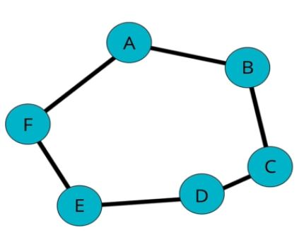

 # Graphs

 ## Introduction
- A graph is a data structure that consists of vertices, nodes, or points together with a set of unordered pairs of these vertices (undirected graph) or a set of ordered pairs (directed graph).
- In simpler terms a graph, like a tree, is a collection of nodes and connections between said nodes. One difference between a tree and a graph is that there is no parent node in a graph; all nodes are treated equally.
- Graphs are used commonly in the following applications:
    - Social Networks: In a social network, people are nodes and their relationships (friendships) act as connections between nodes.
    - Location / Mapping: On a map, locations are modeled as nodes and roads are modeled as the connections between nodes
    - Routing Algorithms: These algorithms aim to find the quickest path to a location by finding the shortest path between two nodes.
    - Recommendation Algorithms: Using video games as an example, these algorithms work by modeling a video game as a central node and the genres it falls under as nodes that radiate out from it. When you do this for multiple games, certain games will be related to one another through their genre (has-many-through relationship). This information can be used to recommend similar games to users.
    - Visual Hierarchy
    - File System Optimizations
## Graph Terminology
- Vertex – A node. In graphs, the nodes act as a point where two or more edges meet. Unlike in trees, where edges must point from a parent to a child, the edges in graphs can point in any direction because nodes aren’t classified as parents or children. This means graphs can form a line, tree, or closed shape or loop.
- Edge – A connection between nodes.
- Weighted / Unweighted – Values are assigned to distances between vertices.
- Directed / Undirected – Directions are assigned to distances between vertices.
- A tree (in graph theory) is an example of an undirected graph in which any two vertices are connected by exactly one path. The tree data structure would technically be a directed graph because nodes must point from parent to child.
- Example Graph:  
    
## Types of Graphs
- Weighted / Unweighted – In a weighted graph, values are assigned to each edge. In an unweighted graph, edges have no assigned value.
- Directed / Undirected – In an undirected graph, the edges have no specific direction; they act as two-way connections. In a directed graph, edges have a specific direction and are often represented with arrows.
## Representing Graphs (Adjacency Matrix / List)
- When trying to represent a graph, you need a way to store the information held in the nodes, as well as the information held in the edges. In a linked list for example, information about the nodes and edges were combined into one class. The value property of the node defined the node, and the next property of the node defined its connection to the next node in the list.
- Representing graphs like linked lists or trees can’t work because various ways nodes can be connected.
- The two standard approaches for representing graphs are the adjacency matrix and adjacency list.
- Adjacency Matrix:  
    
- Adjacency List:  
    
- An adjacency matrix is a 2D matrix where each node is listed on the vertical and horizontal axis, forming a square grid. Each cell holds a Boolean (0 or 1) that represents whether there is a connection between the nodes on the horizontal and vertical axes.
- An adjacency list is a list that is made up of two columns. The left column holds each node in the graph and the right column holds an array that lists each node the node in the left column connects to.
    - An adjacency list can be implemented using an array (if the nodes hold numeric data) or a hash table (if the nodes hold string data).
- An adjacency list can have better space complexity than a matrix if the graph is sparse (not a lot of connections between nodes compared to how many there could be).
- An adjacency matrix can have poor space complexity when being used to represent sparse graphs because, for each node, an additional row and column needs to be added to the matrix. If there is only one connection to this node, that’s a lot of wasted space.
- Adjacency lists are faster at iterating over the edges than matrices. This is because each node (subarray or key) points to the nodes that it connects to, providing information about the edges.
- Adjacency matrices are faster at looking up a specific edge than lists. This is because there is only one edge stored in each cell of the matrix, whereas there can be many edges stored in the key or subarray of a list.
- Adjacency lists can be a better choice than matrices because real-world data tends to be sparse.
- Chart Comparing Performance of a List and Matrix:  
    
## Populating Graphs
- Adding a Vertex: Implementing a graph using an Adjacency List makes adding vertices very easy because you simply need to add a key to the object that represents the list, then set the value of that key to an empty array (the node starts out with zero connections). The function should accept a value as an argument and add that value as a key to the adjacency list object. It should then set the value of that key to an empty array.
- Adding an Edge: The function should accept two vertices as arguments. For an undirected graph, the function should add the second vertex to the array associated with first vertex and vice versa. For a directed graph, the function should only add the second vertex to the array associated with the first vertex.
- Removing an Edge: The function should accept two vertices as arguments. For an undirected graph, the function should remove the second vertex from the array associated with first vertex and vice versa. For a directed graph, the function should only remove the second vertex from the array associated with the first vertex.
    - The function should remove a vertex by reassigning the value of the key to be a new array that does not contain the removed vertex.
    - Recall from React on how to non-destructively modify an array: when adding, use the spread operator; when removing, use filter; and when modifying an element, use map.
- Removing a Vertex: When removing a vertex from a graph, you must also remove all edges associated with that vertex. The function should accept a vertex as an argument, it should then remove all edges associated with that vertex, and then remove the vertex from the adjacency list object.

